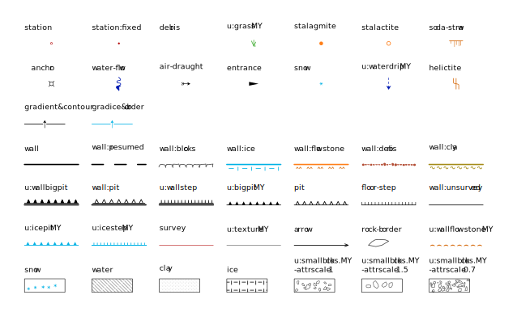

# Migovec Survey Data

This contains the survey data of the Tolminski Migovec cave system, as well as minor caves in the same area, collected by the JSPDT and ICCC from 1974 to 2019.

From 1974-2018 the the survey data was collected in the Survex format but we are now using Therion and are in the process of migrating the old data.

- [Migovec Resurvey Project](#migovec-resurvey-project)
  - [View](#view)
  - [Downloads](#downloads)
  - [Prerequisites](#prerequisites)
  - [Therion Glossary](#therion-glossary)
    - [Internal Data](#internal-data)
    - [A note on scope](#a-note-on-scope)
    - [Exported Data](#exported-data)
    - [Other Key Words](#other-key-words)
  - [Repository and File Structure](#repository-and-file-structure)
    - [Survey data](#survey-data)
    - [Higher level data](#higher-level-data)
    - [Exports](#exports)
  - [How to export data](#how-to-export-data)
    - [Using existing configs](#using-existing-configs)
    - [Make your own config](#make-your-own-config)
  - [Adding data](#adding-data)
    - [Adding survey data](#adding-survey-data)
    - [Adding scraps](#adding-scraps)
  - [Additional steps](#additional-steps)
    - [Connecting caves into systems](#connecting-caves-into-systems)
  - [How to contribute?](#how-to-contribute)
  - [Final considerations](#final-considerations)
  - [Tips](#tips)
    - [Symbols](#symbols)
    - [How do I show the centerline of undrawn maps?](#how-do-i-show-the-centerline-of-undrawn-maps)
    - [How Do I Make a Pillar (solid rock within a passage)?](#how-do-i-make-a-pillar-solid-rock-within-a-passage)
    - [How Do I Control Which Passage Appears On Top of Another?](#how-do-i-control-which-passage-appears-on-top-of-another)
    - [How do I create a skeleton th2 file for a survey?](#how-do-i-create-a-skeleton-th2-file-for-a-survey)
    - [How do I see the EE in aven or loch?](#how-do-i-see-the-ee-in-aven-or-loch)
    - [Therion Error: Map is too large for PDF format. Try smaller scale!](#therion-error-map-is-too-large-for-pdf-format-try-smaller-scale)

## View

You can view any of the 3D models or PDF maps in your browser [here](https://iccaving.github.io/migovec-survey-data/).

## Downloads


As data is added some artifacts are automatically generated. These can be found on the [releases page](https://github.com/iccaving/migovec-survey-data/releases).

Also for convenience here is a list of the artifacts and the links to the latest versions:

**System Migovec**


The full system:

- 3D Model  
  [3D](https://github.com/iccaving/migovec-survey-data/releases/download/latest/system_migovec.3d) |
  [LOX](https://github.com/iccaving/migovec-survey-data/releases/download/latest/system_migovec.lox)
- Plan View (WIP)  
  [SLO PDF](https://github.com/iccaving/migovec-survey-data/releases/latest/download/system_migovec_plan_SLO.pdf) |
  [ENG PDF](https://github.com/iccaving/migovec-survey-data/releases/latest/download/system_migovec_plan_ENG.pdf) |
  [SLO SVG](https://github.com/iccaving/migovec-survey-data/releases/latest/download/system_migovec_plan_SLO.svg) |
  [ENG SVG](https://github.com/iccaving/migovec-survey-data/releases/latest/download/system_migovec_plan_ENG.svg)
- Extended Elevation (WIP)  
  [SLO PDF](https://github.com/iccaving/migovec-survey-data/releases/latest/download/system_migovec_EE_SLO.pdf) |
  [ENG PDF](https://github.com/iccaving/migovec-survey-data/releases/latest/download/system_migovec_EE_ENG.pdf) |
  [SLO SVG](https://github.com/iccaving/migovec-survey-data/releases/latest/download/system_migovec_EE_SLO.svg) |
  [ENG SVG](https://github.com/iccaving/migovec-survey-data/releases/latest/download/system_migovec_EE_ENG.svg)

**Primadona**


Primadona (in full Primadona/Mona Tip/Ubend) is a cave system mostly contained in the Western side of Migovec. It was connected to the main system in 2015. It is accessed from impressive entrances midway across the western cliffs of the Migovec plateau.

- 3D Model  
  [3D](https://github.com/iccaving/migovec-survey-data/releases/download/latest/primadona_ubend_mona_tip.3d) |
  [LOX](https://github.com/iccaving/migovec-survey-data/releases/download/latest/primadona_ubend_mona_tip.lox)
- Plan View (WIP)  
  [SLO PDF](https://github.com/iccaving/migovec-survey-data/releases/latest/download/primadona_ubend_mona_tip_plan_SLO.pdf) |
  [ENG PDF](https://github.com/iccaving/migovec-survey-data/releases/latest/download/primadona_ubend_mona_tip_plan_ENG.pdf) |
  [SLO SVG](https://github.com/iccaving/migovec-survey-data/releases/latest/download/primadona_ubend_mona_tip_plan_SLO.svg) |
  [ENG SVG](https://github.com/iccaving/migovec-survey-data/releases/latest/download/primadona_ubend_mona_tip_plan_ENG.svg)
- Extended Elevation (WIP)  
  [SLO PDF](https://github.com/iccaving/migovec-survey-data/releases/latest/download/primadona_ubend_mona_tip_EE_SLO.pdf) |
  [ENG PDF](https://github.com/iccaving/migovec-survey-data/releases/latest/download/primadona_ubend_mona_tip_EE_ENG.pdf) |
  [SLO SVG](https://github.com/iccaving/migovec-survey-data/releases/latest/download/primadona_ubend_mona_tip_EE_SLO.svg) |
  [ENG SVG](https://github.com/iccaving/migovec-survey-data/releases/latest/download/primadona_ubend_mona_tip_EE_ENG.svg)

**Vrtnarija**


Connected to the main system in 2012, Vrtnarija comprises roughly a third of the passage in the sytem. It is accessed from entrances on the Eastern side of the Migovec plateau.

- 3D Model  
  [3D](https://github.com/iccaving/migovec-survey-data/releases/download/latest/vrtnarija.3d) |
  [LOX](https://github.com/iccaving/migovec-survey-data/releases/download/latest/vrtnarija.lox)
- Plan View (WIP)  
  [SLO PDF](https://github.com/iccaving/migovec-survey-data/releases/latest/download/vrtnarija_plan_SLO.pdf) |
  [ENG PDF](https://github.com/iccaving/migovec-survey-data/releases/latest/download/vrtnarija_plan_ENG.pdf) |
  [SLO SVG](https://github.com/iccaving/migovec-survey-data/releases/latest/download/vrtnarija_plan_SLO.svg) |
  [ENG SVG](https://github.com/iccaving/migovec-survey-data/releases/latest/download/vrtnarija_plan_ENG.svg)
- Extended Elevation (WIP)  
  [SLO PDF](https://github.com/iccaving/migovec-survey-data/releases/latest/download/vrtnarija_EE_SLO.pdf) |
  [ENG PDF](https://github.com/iccaving/migovec-survey-data/releases/latest/download/vrtnarija_EE_ENG.pdf) |
  [SLO SVG](https://github.com/iccaving/migovec-survey-data/releases/latest/download/vrtnarija_EE_SLO.svg) |
  [ENG SVG](https://github.com/iccaving/migovec-survey-data/releases/latest/download/vrtnarija_EE_ENG.svg)

**M18 / M16 / M2**


Collectively known as 'the old system' or sometimes 'sysmig', these entrances were originally explored by the JSDPT from the 70s. Joined by ICCC in 1994, exploration was continued until roughly 2001. M2/M8 and M16/M18 connections were made early on in 1996.

- 3D Model  
  [3D](https://github.com/iccaving/migovec-survey-data/releases/download/latest/m2_m16_m18.3d) |
  [LOX](https://github.com/iccaving/migovec-survey-data/releases/download/latest/m2_m16_m18.lox)
- Plan View (WIP)  
  [SLO PDF](https://github.com/iccaving/migovec-survey-data/releases/latest/download/m2_m16_m18_plan_SLO.pdf) |
  [ENG PDF](https://github.com/iccaving/migovec-survey-data/releases/latest/download/m2_m16_m18_plan_ENG.pdf) |
  [SLO SVG](https://github.com/iccaving/migovec-survey-data/releases/latest/download/m2_m16_m18_plan_SLO.svg) |
  [ENG SVG](https://github.com/iccaving/migovec-survey-data/releases/latest/download/m2_m16_m18_plan_ENG.svg)
- Extended Elevation (WIP)  
  [SLO PDF](https://github.com/iccaving/migovec-survey-data/releases/latest/download/m2_m16_m18_EE_SLO.pdf) |
  [ENG PDF](https://github.com/iccaving/migovec-survey-data/releases/latest/download/m2_m16_m18_EE_ENG.pdf) |
  [SLO SVG](https://github.com/iccaving/migovec-survey-data/releases/latest/download/m2_m16_m18_EE_SLO.svg) |
  [ENG SVG](https://github.com/iccaving/migovec-survey-data/releases/latest/download/m2_m16_m18_EE_ENG.svg)

## Prerequisites

To compile the data and draw surveys you will need some software installed.

For compiling and exporting:

- [Therion](https://therion.speleo.sk/download.php) - The main thing.
- [Survex](https://survex.com/download.html) - Used by Therion to generate `.3D` files.

For drawing we are using Inkscape and the Therion Inkscape extensions because we think its nicer than using the Therion editor:

- [Inkscape](https://inkscape.org) - Vector drawing program
- [Inkscape Therion Extensions](https://github.com/speleo3/inkscape-speleo/) - The extensions that allow you to draw Therion scraps in Inkscape.

(Optional) For editing the text files:

- [VSCode](https://code.visualstudio.com/Download)
- [VSCode Therion Extension](https://marketplace.visualstudio.com/items?itemName=rhystyers.therion)

## Therion Glossary

Therion has a complex vocabulary of its own so here is a basic translation.

### Internal Data

- **survey** : main data structure, which can be nested _ad nauseam_ to represent karst areas, caves or passages. Each survey has an object id, which must be unique within the scope of the higher level survey. Likewise, any object within a survey has unique id (from stations, to maps, scraps)
- **centreline**: survey data specification., with syntex mostly derived from Survex,
- **Scrap** - The most basic drawing element, a piece of 2D map. It will consist of the walls and stations of the passage as well as lots of extra information (should you choose to draw it!) like boulders, pits, passage gradients etc. A single set of survey data (a single passage) can have many scraps associated with it. It is often good to split the drawing over many scraps as this allows Therion to do clever things (like depth colouring). Scraps cannot overlap themselves.
- **Map** - The higher level drawing element. A map can be made of scraps, or it can be a map of maps. Maps are how you collect individual drawn passages into larger blocks. For example a passage like Aqueduct will have its scraps collected in a map called `m-all-p` (). A bigger map might be called `m-below_klic_globin-p` and contain maps from Aqueduct and many other passages (e.g. m-all-p@aqueduct, m-all-p@klic_globin, etc...). The `m-below_klic_globin` will be collected into an Primadona map `m-all-p@Primadona` with all the other maps in Primadona and finally that will collected with the maps from Vrntarija and the old system into a full System Migovec map. The advantage of this heirarchical structure is that you can export these maps at any level, whether you want an overview of the full system or a higher resolution look at the pushing front.

### A note on scope

Scope can be roughly understood as the level of the survey we are working in.
If we are for instance equating stations between two different passages of a cave (say M16), then we are within the M16 scope.
As mentioned previously, all objects in Therion have an id, whether is a survey, a map, a scrap, a line or a point.
Due to the hierarchical nature of the data structure and the fact that each id must be unique within each level of survey, which is why we have uniquely named stations in each passage, and uniquely named passages in each cave, and so forth.

### Exported Data

Therion can export to a number of formats.

- **Map** - A 2D representation of the survey data. Usually a `.pdf` or `.svg`.
- **Atlas** - A 2D representation of the survey data split into pages for convenient printing.
- **Model** - A 3D representation of the survey data. Usually a `.3d` or `.lox` file viewed in aven or loch.
- **Database** - Survey data dumped to a database for whatever reason. Usually a `.sql` file.

### Other Key Words

- **equate** - An equate lets Therion know that two stations are the same (that they are joined). This is how basically all the export formats are constructed.
- **join** - A join lets Therion know that two scraps, or lines should be joined. It does its best to match up any walls that are nearby each other to create a seamless passage when exporting maps and atlases.

## Repository and File Structure

It can be hard to know where to start in a repository of this size so here is an overview of how things are organised and what various files and folders are for.

### Survey data

The raw data, usually created in the cave, or shortly after. These are within the `data\{cave}\{year}\{passage}` directories.

These will likely represent single pushing trips.

- `.th` files contain the survey data (between `centreline/endcentreline` flags)
- `.th2` files contain the scraps (drawings beginning with `scrap {scrap-id}/endscrap` flags)

The `.th` will probably also enclose any scraps (in the `.th2`) within the passage as a named map. This will have been autogenerated by Topodroid in many cases.

### Higher level data

In the `data\{cave}` folders you will find `.th` files that define how these individual passages are connected.

- `{name}.th` will be used to defined equates in the survey and join scraps between passages
- `{name}.thm` will be used to combine individual passage maps into larger maps.

In the `{name}.th` file, passages are arranged by year of discovery.
In the `{name}.thm` file, passage map definitions are ordered by cave sub-region, and these subregions are themselves ordered into a map definition for the cave (a high level m-all-p, within the scope of the cave).

### Exports

With the data thus organised you can export maps in pdf and svg files and models in .3d and lox files. This is done through a further two types of file.

In the `configs` folder there are `.thconfig` files. These are more similar to a shell script if you are familiar with those. They contain commands to produce output files like pdfs etc. They combine the named maps and `layouts` to make the output.

In the `layouts` folders there are layout files (`.thl`) these are complicated but they basically just define which symbols should be on the
map and how they should be like. i.e. should you show mineral symbols, how thick should pit lines be, what colour are waterfalls.

## How to export data

So how do you export the data to a map or model?

### Using existing configs

The easy way is to find yourself the config file that already does what you want. In the `configs/overview` directory you'll find a number of useful configs. For example `vrtnarija.thconfig` will export pdfs, svgs, and 3d files that show Vrtnarija. You just need to run it with Therion.

```
therion configs/overview/vrtnarija.thconfig
```

And you should find that it places the files in the `outputs/maps` and `outputs/models` directories.

Note that in order for compilation to be correct you must ensure Therion uses the `therion.ini` file in the root of this repository. You can do this either by simply running all `therion` commands from the root directory, or by setting the `$THERION` environment variable to the root directory.

### Make your own config

None of the configs export exactly what you want? Make your own!

A config file will look like this:

```
encoding  utf-8

#----------------------------------------------------------------------------------|
# select a source data file.
source "../../data/primadona_ubend_mona_tip.th"

#----------------------------------------------------------------------------------|
# input the layout files
input "../../layouts/base-p.thl"
input "../../layouts/base-e.thl"
input "../../layouts/mods.thl"

#----------------------------------------------------------------------------------|
# select the relevant map definitions, and levels within those maps
select mprima_ubend_mona_tip-p@system_migovec -map-level 1

#----------------------------------------------------------------------------------|
# export a PLAN view and specify the layout
layout plan
	copy base-p
	copy colour-by-new
endlayout
language sl
export map -projection plan -o ../../outputs/map/primadona_ubend_mona_tip_plan_SLO.pdf -layout plan
language en
export map -projection plan -o ../../outputs/map/primadona_ubend_mona_tip_plan_ENG.pdf -layout plan

#----------------------------------------------------------------------------------|
# export a .3d model, which can be opened in AVEN and LOCH
export model -o ../../outputs/model/primadona_ubend_mona_tip.3d -fmt survex
```

## Adding data

### Adding survey data

You have a some `.th` files from topodroid or from an svx conversion. Here's what to do with them.

We have used a pyramidal hierarchy,

```
survey plateau
  survey system_migovec
    survey primadona_ubend_mona_tip
      survey primadona
        YEAR N
        survey {passage1}
        endsurvey
        ...

        survey {passage2}
        endsurvey

        YEAR N+1
        survey {passage3}
        endsurvey
        ...
      endsurvey

      survey {other_main_entrance}
      endsurvey
      ...
    endsurvey

    survey {other_system}
    endsurvey
    ...
  endsurvey

  survey {other_cave}
  endsurvey
  ...

  surface  # a DEM of the plateau (WIP)
  endsurface
endsurvey
```

With a system, cave, passage structure. Save the `{my_new_passage}.th` file into a new folder with lower case name (as far as possible, the same as the survex survey name).

Find the `{cave}.th`file in the `{cave}` folder. This file contains a series of `input ./year/passage/passage.th` commands to tell the therion compiler to include the relevant survey data. Adding the command `input ./year/passage/my_new_passage.th` to this file in the correct year folder is necessary, but we now need to connect the new data to an existing point in the survey, i.e. equate.

Below the input blocks, you will find a series of `equate` commands, this is where you can tie in your new cave passage to the existing centrelines.

The main `{cave}.th` file will therefore look similar to this:

```
survey {cave} -title "The name of the cave"

#ignore the 'map' blocks for now.

map m-all-<p/e> -projection <plan/extended>
 mYear1-<p/e>
 mYear2-<p/e>
 ...
endmap

#______Year1______


input ./{year1/passage_1/passage_1.th
input ./year1/passage_2/passage_2.th
input ./year1/passage_3/passage_3.th
...

equate stationX@passage_1 stationY@passage_2 #the main equate commands between passages.
equate stationZ@passage_2 stationW@passage_3 #the main equate commands between passages.
...

join scrapX@passage_1 scrapY@passage_b #some join commands between survey maps
...

#______Year2______

input ./year2/passage_4/passage_4.th
input ./year2/passage_5/passage_5.th
...

equate stationN@passage_4 stationM@passage_3 #equates to current and previous years.
                                             #The scope here is the cave, so we need to indicate the passage id

endsurvey
```

Commit your changes!

### Adding scraps

This assumes you have drawn the passage already using the Xtherion editor or Inkscape or Topodroid.

`my_new_passage_plan.th2` resides in the `my_passage` folder. In `my_new_passage.th`, you need to add the command `input my_new_passage_plan.th2` below the `survey MySurvey` flag. Below the .th2 input command, you should write a `map mMySurvey-p -projection <plan/extended>` and `endmap` command pair.

Inside the map command block, you will include maps or scraps (you can't use a mix of the two). If using a typical Topodroid export, then the 'map' section of the .th file will look like the example below.

```
survey {passage} -title "The name you gave to the cave passage"

input {passage}_p.th2  # including the plan view drawing from xtherion or Inkscape
input {passage}_e.th2 # including the extended elevation view from xtherion or Inkscape

map m-all-<p/e> -projection <plan/extended> # this is a map of maps
 m1<p/e>            #this is a map
 m2<p/e>
 ...
endmap

map m1<p/e> -projection <plan/extended>  #this is a map
 MySurvey-1p                              #this is a scrap
endmap

map m2<p/e> -projection <plan/extended>
 MySurvey-2p
endmap

join MySurvey-1p MySurvey-2p # specify a join so the passages are morphed to join together (semi automatic)

join LineId1:O LineId2:end  #this is a manual join of two lines.
                            #No need to specify scrap, as the scope of this environment is the entire
                            #survey.

centreline
 team "Surveyor1Name Surname" role
 team "Surveyor2Name Surname" role
 date YYYY.MM.DD

 data
 1 2 ... ... ...
 2 3 ... ... ...
 ...
endcentreline

endsurvey
```

### Generating Scraps

We need a scrap with the centerline defined (a skeleton) in order to start drawing. you have data that does not already have 2D files associated with it then it is hard to create a scrap for it with just Therion. Luckily we have a script to help us out.

**Plan**

Generating a skeleton plan is very easy. You run the script providing the path to the therion survey file, and the `id` of the survey itself:

```
python3 scripts/create_2d.py path/to/passage.th name-of-survey
```

For example I would write the following to produce a skeleton scrap for `Beam Me Up`:

```
python3 scripts/create_2d.py data/primadona/2021/beam_me_up/beam_me_up.th beam_me_up
```

You can also specify a higher level survey and use a more specific `id`. Using the same example:

```
python3 scripts/create_2d.py data/system_migovec.th beam_me_up.primadona.primadona_ubend_mona_tip.system_migovec
```

We use the main System Migovec file, and then provide the full system `id` to `Beam Me Up`.

**Extended Elevation**

Generating a skeleton elevation is roughly the same as the plan, but you must be careful to use a survey file that ensures all of the extend commands are included. This is because an extend command included in a high level survey file will affect how the centreline looks and therefore how the scrap will need to be drawn. In general for an extended elevation it is safest to use the `data/system_migovec.th` file.

For `Beam Me Up` we can run:

```
python3 scripts/create_2d.py --projection extended data/system_migovec.th beam_me_up.primadona.primadona_ubend_mona_tip.system_migovec
```

Notice we also specify `--projection extended`.

## Additional steps

### Connecting caves into systems

You will find that additionally, you need to specify cave connections.
These are taken into account in the `MySystem.th` file.

This will look like:

```
survey MySystem -title "The actual System name"
map mMySystem-<p/e> -projection <plan/extended> # The system map contains each cave map.
 mMyCave1-<p/e> #the cavemaps contain the specific year maps, which themselves contain passage maps. The latter contain scraps.
 mMyCave2-<p/e>
endmap

input MyCave.th
input MyCave2.th

equate stationX@MySurveyX.MyCave1 stationY@MySurveyY.MyCave2 #There is no 'year' layer in the survey hierarchy.

join LineId1@MySurveyX.MyCave1:0 LineId2@MySurveyY.MyCave2:end #a tedious manual join between two points of lines within surveys of different caves.

endsurvey
```

## How to contribute?

- Add new data each year
- Redraw the old survey data in Therion format
- Find poorly drawn areas of the survey and improve them

## Final considerations

This survey data was collected between the year 1974-2019 by Imperial College Caving Club (ICCC) and Jamarska Sekcija Planinskega Drustva Tolmin (JSPDT).

## Tips

### Symbols

Throughout the process of migrating the survey data, we have used metapost to redefine several symbols to our liking.
You can find the general symbology below and download a pdf.

There are two main types of symbol definitions:

1. Symbols which existed already in the therion source code, such as `point station` or `line wall:blocks`.
2. User defined symbols which are not available in the source code and require a different prefix, for instance `u:grass_MY`

All the metapost definitions are located in the `layouts/metapost` directory.

```
layouts
  |__ metapost
  |    |__ areas.thl
  |    |__ lines.thl
  |    |__ points.thl
  |    |__ ...
  |
  |__ base-e.thl
  |__ base-p.thl
```

The `base-e.thl` and `base-p.thl` layout definition files contain the therion language modifiers, e.g. symbol colour specification or style assignments.

To use either base-e or base-p therion layouts in your config file, simply call:

```
input {path/to/layouts}/base-e.thl

layout local-e
  copy base-e
endlayout

export -o {path/to/map} -projection extended -layout local-e

```

Main symbology and symbol codes:



	
[symbology PDF](https://github.com/iccaving/migovec-survey-data/releases/latest/download/symbology.pdf)

### How do I show the centerline of undrawn maps?

Therion by default shows only drawn maps, even when you have told it to disaply centerlines and stations (which obviously exist for undrawn passages). To show these undrawn centerlines you must include the survey name in a map and then select that map. For example my config might look like this:

```
# Input the data and layouts as normal
source "../../data/vrtnarija.th"

input "../../layouts/base-p.thl"
input "../../layouts/mods.thl"

# Create a source block to define a special map
source
  # This map includes the full vrtnarija map (m-all-p) as well as the survey
  # itself (vrtnarija)
  map include-centerline -projection plan
    vrtnarija
    m-all-p@vrtnarija
  endmap
endsource
# Select the new map
select include-centerline

# Setup the layout with the show-centerline mod
layout plan
	copy show-centreline
	map-header 0 0 off
	scale 1 2000
endlayout

# And export as normal
language en
export map -projection plan -o ../outputs/plan_ENG.pdf -layout plan
```

### How Do I Make a Pillar (solid rock within a passage)?

Firstly draw the wall clockwise, the opposite way to exterior walls, so that
the blue and yellow ticks point outwards into the passage. Then set an option
on the wall `-outline in`. In Inkscape this is done in `Object Properties` pane
in the `title` text box. In the `th2` file you can add this option on the line
defintion `line wall -outline in`.

### How Do I Control Which Passage Appears On Top of Another?

Therion decides this based on the passage order in the map definition. The
higher in the map definition, the higher z-index it is given and the higher it
appears on the survey.

Sometimes this is a bit buggy (for example two scraps defined in a map) and it
is necessary to seperate the scraps with a `break` command:

```
map m-all-p -projection plan
  wonderland-1p    # this one will be rendered on top
  break
	wonderland-2p    # this one underneath
endmap
```

### How do I create a skeleton th2 file for a survey?

Run the `create_2d.py` script:

```
 python3 scripts/create_2d.py.py data/system_migovec.th <survey_selector> --projection <projection>
```

Replace `<survey_selector>` with the selector for the survey you want to compile i.e. `firstdraft@vrtnarija.vrtnarija_vilinska.system_migovec`. Also replace `<projection>` with either `plan` or `extended`.

The selector is relative to the survey file you set. We have set `data/system_migovec.th` so we need a full selector `firstdraft@vrtnarija.vrtnarija_vilinska.system_migovec`. If you were to set `data/vrtnarija/vrtnarija.th` then you would only need to select `firstdraft`. (In fact just `firstdraft` will work even when using `data/system_migovec.th` because the script can work out if there's only one `firstdraft` in the whole system).

For the EE it is important to always generate from the highest level survey (`data/system_migovec.th`) because of how the extends are defined and how they cascade. For the plan this does not matter so you could just do `python3 scripts/create_2d.py.py data/vrtnarija/2015/firstdraft/firstdraft-p.th2 firstdraft --projection plan`.

### How do I see the EE in aven or loch?

This is a bit of a hack but the `create_2d.py` can be used to generate a `.plt` file that will open in aven and loch.

```
 python3 scripts/create_2d.py.py data/system_migovec.th <survey_selector> --projection extended --format plt --out <name>.plt
```

Then just open the `.plt` in aven or loch.

### Therion Error: Map is too large for PDF format. Try smaller scale!

This error often happens if you have an empty scrap, i.e. a scrap with no stations in it. If you have been making a new map with multiple scraps ensure you have copied the relevent stations across into the new layers.

Alternatively this might actually be the scale so you can try changing the scale in your layout:

```
layout plan
  ...
	scale 1 2000
  ...
endlayout
```
