# The Surface Atlas 🗺️

> **Note**
> 
> **Please edit** if you see anything missing or wrong using the pencil icon on the top right!!
> 
> All changes are saved in Git so it's very easy to undo later.

Information on each of the cave entrances was previously scattered between sources such as the various editions of the Hollow Mountain, images on the club website and the depths of the minds of the many explorers. Here is a first attempt to gather all useful information into one central place for convenient reference. This should make it easier to see which caves have potential and which are conclusively dead, when each cave has been previously explored and record any other useful information gathered by previous explorations.

# Formatting 

Currently, each entrance has:
 - Every name its been referred to as
 - Some images allowing for relocation of the entrance
 - A GPS location, but these aren't uploaded to GitHub yet and so aren't in the atlas
 - All key information, sorted by year/entry 
   - Importantly, please reference if you're getting your info from a written source
   - This really doesn't take much effort, but saves hours of time for future cavers, eg. [HM1, page 1]
   - Try to add names if you can, they're only missing when they couldn't be remembered

# General Information

- Known caves of Migovec in 1993 table on HM1, page 13
- In 1994 "a significant amount of time was spent locating and re-marking the caves with spray paint" [HM1, page 13]
- Map of entrances up to 2006, HM1 page 14
- Blowing holes trip of 1995 marked 56 holes with paint an inaccurate GPS locations (B series) [HM1 page 29]
- K series (Kuk) were initially explored in 2005, although not all were dug and many trips had insufficient digging equipment
- Jana and Jarv marked the JJ series of caves in 2006 on the western cliffs of the plateau, as well as numbering the valleys V1 through V12 with descriptions written up in HM1, page 214
- The A series was logged in 2008 with A1 to A4, although little information is given on them [HM2 draft page 44] where A does not stand for Andy
- First mention of area N (North of Kuk) is in HM2 2012, although presumably this area had been visited before

# Individual Entrances

### A1 through A4

  
  
  
  

- Discovered in 2008 [HM2 draft, page 44]
  - No information other than that they were logged and they are "worth a go down and look"
- Relogged in 2022
  - A1 has two stainless bolts in it
    - Rhys remembers going down it once upon a time so likely dead

### Andy's Dig

- No longer a secret as of 2022
  - Relogged on the GPS
  - Still diggable but pretty sketchy, with tent poles holding up boulders
  - Reached by going along the old Mig path before turning down a gulley
  - Can also be reached from below, walking up the gulley
  - From the path down the Gulley, climb up towards an obvious alcove
  - Dig is in the back left of the alcove, and down a 5m free climb

### B5

  
  

- Spotted in 2022 from red paint marking
  - No known information
  - Gravel filled and would require a lot of work
  - Very mossy, not promising

### B10

- Dug in 2014, first discovered during the blowing holes recce of 1995 [HM3, page 61, page 104]
  - Contains a narrow tube suitable for digging
  - More digging required

### B12

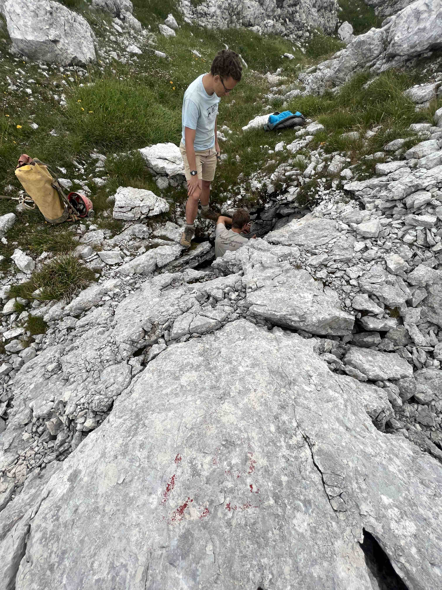

- Spotted in 2022 from red paint marking
  - No known historical information
  - Red paint can just be seen in bottom of image
  - Appears to be a 10m drop blocked by boulders
  - Digging attempted without tools but little progress made
  - Requires long chisel for entrance widening and oversuit to protect (squeeze not passed due to this)
  - Entrance may need traverse line for protection through squeeze
  - Definitely worth returning with tools

### B20

- Re-logged in 2022
  - Good digging potential but hasn't been investigated to the end
  - If it connected with M2, it would give extra height to the system

### Bone Cave

- Mentioned in passing in HM1, page 215, but no information provided other than it being near the V10 valley
- 2022
  - Note that Bone on the old GPS coordinates seems to correspond to a random shake hole by the tents, likely a different cave since V10 valley infers it being on the cliff
  - No cave there, only a 1 foot deep hole
  - Image is of the shake hole by the tents

### C1

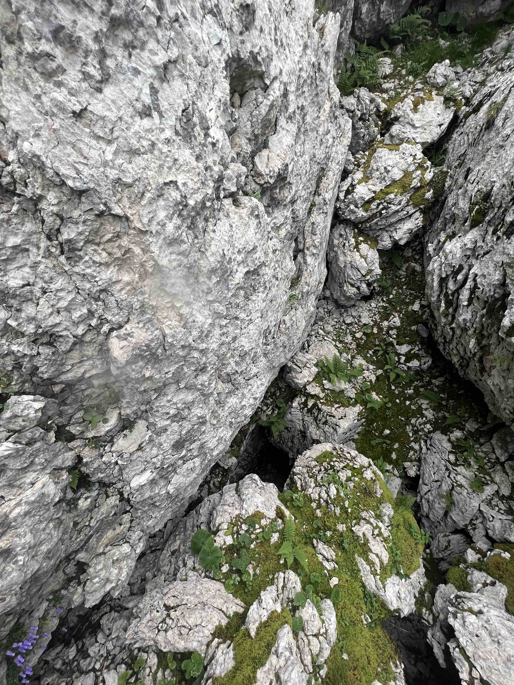

- Area C being the area around the container
- Spotted and logged in 2022
  - No previous entrance marked on the GPS in the area
  - Goes around 10m until a small boulder filled chamber

### Coincidence Cave

- Discovered in 2015 [HM3, page 113]
  - Initially dug but requires more work
- Revisited in 2018 (not written up)
  - Breakthrough made to series of chambers
- Further explored by the Slovenians after 2018
  - All leads seem to have died, from word of mouth
- Revisited in 2022
 - End of cave terminates in boulder floor at base of pitch, this would be difficult to dig
 - According to Matti, draft disappears into hole above final pitch, may be diggable
 - Perry has started bolt climbing avens from entrance, first one dead

### DW's 1996 Dig

- Nearby to Royston Vasey, mentioned in HM2 draft page 44, 2008
  - Worth going back down again
- Relocation was attempted in 2022
  - No obvious dig could be found, may be the small filled in hole 5m towards Kuk from Royston Vasey
  - Not promising

### E1

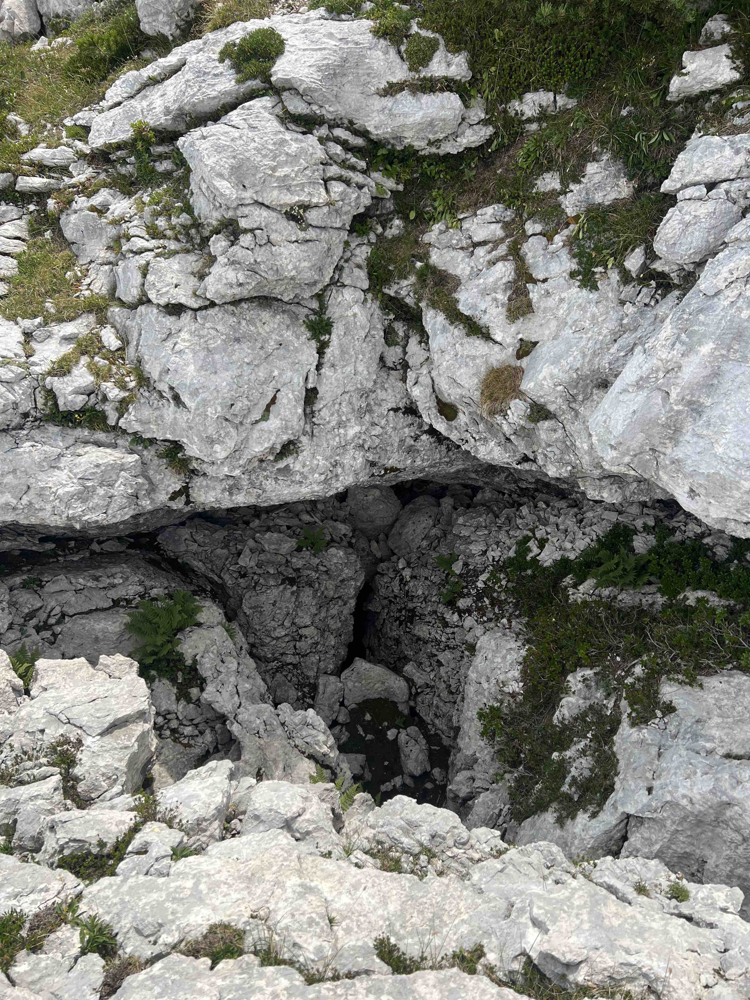

- Discovered in 2007 [HM2 draft, page 14]
  - A 25m pitch leading to small windows which require widening to pass
- Revisited in 2008 [HM2 draft, page 41]
  - Some leads killed but may be ongoing, unclear from description

### E2

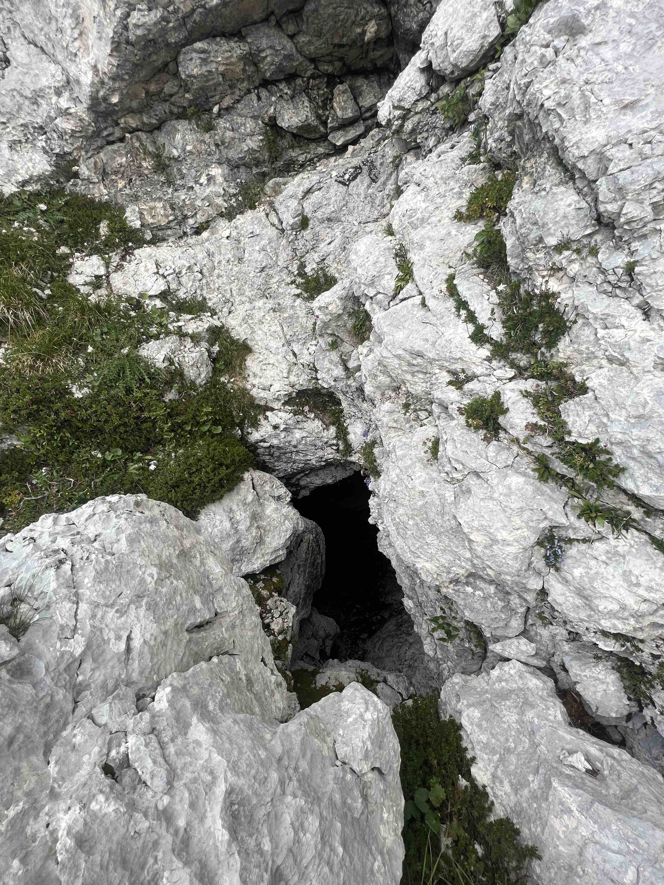

- Relogged in 2022
- Visited either 2018 or 2019
  - Ben R remembers poking around it with Janet at some point
  - No obvious leads that he can remember
  - Could be revisited

### E8

- Not a cave
  - Logged as "obvcave" on historical GPS files
  - Just an alcove, like K1
  - Small free climb through to the roof

### East Pole, S1

- Mentioned in HM1, page 99, 1998
  - Multiple chambers and small pitches, but very unstable
  - Multiple digging trips have since returned to the cave with no major breakthroughs
  - "[a] promising lead"
- Revisited in 2017 [HM3, page 271]
  - Did not manage to make progress on the upwards dig
  - Marginal progress was made over a tight rift, despite the loss of the lump hammer

### Gondolin

- Discovered in 2017 [HM3, page 232]
  - Pushed for three pitches before the cave dies

### Hare Cave

- Description in HM1, page 183, 2004
  - Was guarded by a large hare in 2003, so left until 2004
  - Draughting strongly from the floor
  - Seems to be a false floor at the top of a rift, could be dug
  - Small phreatic "torpedo" tubes found in upper levels
- Revisited in 2005 [HM1, page 191]
  - Torpedo tubes all found to close down, no leads left
- Revisited in 2006 [HM1, page 206]
  - Investigated a phreatic tube but it didn't seem to go anywhere
  - A strongly draughting dig in the centre of the chamber but more digging is required to see if this goes or not
- Revisited in 2017 [HM3, page 231]
  - As previously reported, the "torpedo tubes" do not go and no more leads were found

### Jailbreak

- Discovered in 2013 [HM3, page 34]
  - Although it leads to a chamber with many ways on, all of them seem to die
  - Perhaps possible to dig, but no easy places
- Revisited and killed in 2014 [HM3, page 58, page 104]
  - Survey and description in HM3 reference
  - Main lead was killed after hauling a boulder out of the way, other lead was also killed

### Janet's Little Cave

- Description in HM1, page 184, 2004
  - Small airy passage in the side of a shakehole near the Kuk path
  - Tube from first chamber into second chamber that hasn't been pushed
  - Ongoing lead as of 2004
- Explored and surveyed in 2019 by Tanguy Racine
  - This was when the Disto data was added to the GitHub repo
  - Presumably found to be dead? No indication of any leads
- Revisited by DPW and Leo Antwis 2022
  - Also found cave to be dead, after checking thoroughly for leads (including through tight hole)

### JCC

- Unsure if this is a cave or not, a GPS waypoint of this name is mentioned in HM2 draft, page 44, 2008
  - East of M19 there is large entrance with a draughting dig that looks promising

### JJ1

- Discovered in 2006, HM1 page 214
  - Multiple caves in the V8 valley, unclear which is JJ1 from HM1 description alone
  - Seems to be a small chamber, a blowing aven and an unpushed wet crawl

### JJ2, Pella's Feathers

- Discovered in 2006, HM1 page 214
  - Many caves in the V9 valley, but this one is an obvious triangular hole
  - A crawl continues for 10m before splitting
  - The left branch dies, whilst the right branch ends with a rock that requires clearing to progress further

### JJ3, Hawk Cave

- Discovered in 2006, HM1 page 216
  - Initially discovered by Andrej Fratnik and "the other Andrej" back in the 70s
  - Rough survey and description given in HM1 (see above page)
  - Many drafting leads left due to lack of digging equipment and over suits
- Revisited in 2007 [HM2 draft, page 15]
  - Left ongoing due to lack of rope and time

### JJ4

- Discovered in 2006, HM1 page 215
  - A winder on the side of Kuk
  - No indication of any leads

### JJ5

- Discovered in 2006, HM1 page 215
  - Crawls and chambers end in a desperate dig beneath hanging death

### JJ6

- Not a cave, but a waypoint set in 2006, HM1 page 215
  - Many caves are visible from this point

### K1, The Goat Shelter

- An obvious entrance on the flank of Kuk that only goes to a higher entrance with no leads [HM1, page 195, 2005]

### K2

- Discovered in 2005 [HM1, page 195]
  - Easy digging and massive draught
  - Rock is very loose
  - Two days of digging in 2005
- Revisited in 2012 [HM2 draft, page 136]
  - Seems to have the most potential of all the area K caves
  - Much digging required before it goes
- Revisited in 2015 [HM3, page 140]
  - Found to "not go" although given it was an existing dig, this may have been subjective
- Revisited in 2022
  - Goes into small chamber with dig off to the side
  - Possible to dig in crawl sloping up towards the surface
  - No draft felt on a very warm and still day
  - Not very promising

### K3

- A large 30m shaft on top of Zeleni Vrh, believed bottomed in the early 90s [HM1, page 195, 2005]

### K4

- Entrance on north face of Kuk, found to just be a window with light filtering in from above [HM1, page 195, 2005]

### K5

- Entrance on west end of north Kuk face [HM1, page 195, 2005]
  - Abseiled down to scree floor but unclear if cave is completely dead

### K6

- First mentioned 2005
  - Sharp crawl through to mud floor opening out with small draught, could be pushed further with elbow pads [HM1, page 195, 2005]
- Revisited in 2012 [HM2 draft, page 136]
  - Good progress was made with digging
- Revisited in 2022
  - Closes down into a dig which gets narrower not bigger
  - No obvious draft on a very warm and still day
  - Could be dug further but not very promising

### K7

- A dodgy chamber reached by a 5m clamber over boulders [HM1, page 195, 2005]
  - Small draught, may be possible to dig

### K8

- Overhang into a small choked chamber [HM1, page 195, 2005]

### K9

- Quickly opens out into a 15m pitch [HM1, page 196, 2005]
  - A twin pitch is reachable from a large window
  - Dig potential in a draughting collection of rubble
- Revisited in 2022
  - Located the entrance to photograph and log the GPS location, but pitch not descended

### K10

- A very small hole currently blocked but with obvious continuation [HM1, page 196, 2005]
  - Currently only descends 3m
  - stoned rattle when pushed to the north
  - Would need to remove sharp rock blades and lift out boulders in order to progress any further
- Revisited in 2022
  - Human sized hole in pavement that's very grabby and unpleasant
  - Person sized alcove at the bottom, with another person sized alcove off to the side at floor level
  - No indication of any continuation or possible digs, not promising

### K11

- Scree climb into a chamber at the end of a shakehole with a cold draught and good digging possibilities [HM1, page 196, 2005]
- Revisited in 2012, presumed to be reasonably promising but not incredible [HM2 draft, page 136]
- Revisited in 2022
  - Obvious entrance in large shake hole which leads to moderately sized chamber
  - Small descending hole on right side of entrance which may be possible to dig

### K12, Victoria Coach Station

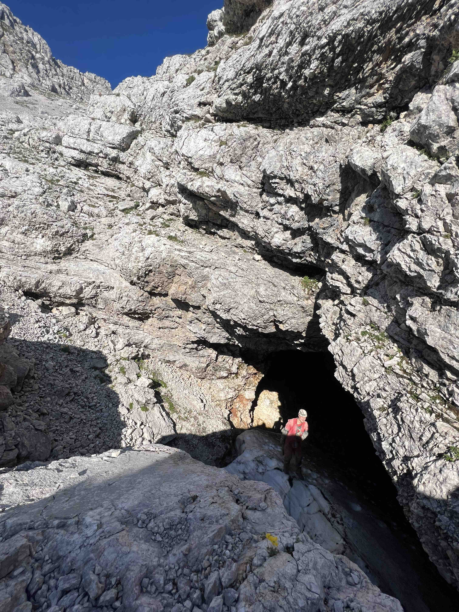

- A very large entrance leading to a large snow slope [HM1, page 196, 2005]
  - Enormous draught in places, but many crawls blocked with ice and rubble
- Revisited in 2012, presumed to be reasonably promising but not incredible [HM2 draft, page 136]
- Revisited in 2015 [HM3, page 140]
  - Two days of digging resulted in slow progress
  - Crawl get's narrower
  - Still a "promising" lead
- Revisited in 2022
  - Lead to back of main chamber is a dig continuing in a few meters but with a very loose roof which rocks fell from when crawled through
  - Dig is ongoing but sketchy given looseness of surrounding rock
  - Small alcove found between boulders and snow plug by entrance, no continuation but with more melting this may reveal further alcoves
  - No other leads / crawls could be found, leaving only the scary dig

### K13, Pedestrian Subway / Arrivals Hall

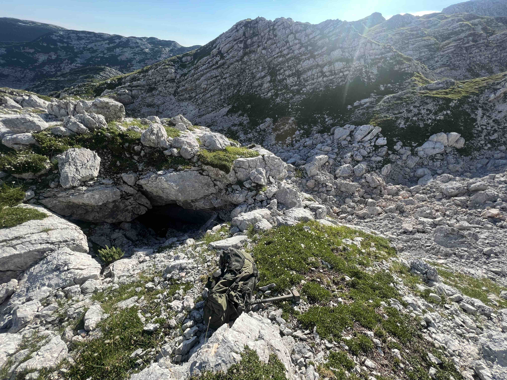

- Rift directly above K12 with possible dig to the South East and rift in floor connecting with the K12 main chamber [HM1, page 197, 2005]
- Revisited in 2022
  - An infuriatingly good entrance that is completely free of rock and gravel, but unfortunately goes straight back into the roof of K12
  - No indication of any other leads, not promising

### K14

- A shallow rift leading to a small chamber, likely to break onto the surface but not pushed fully [HM1, page 197, 2005]
- Revisited in 2022
  - Rift drops down into boulder filled chamber
  - Route going towards surface
  - Another possible dig underneath the entrance but not easy
  - Overall not promising

### K15, K15i (The Rik-Venn Imaginary Series)

- A big blowing and cold cave ending in a dig [HM1, page 197, 2005]
  - Goes in ten meters south and down before reaching a choke underneath a suspended boulder
  - Choke has been dug for one hour but lacked crowbar
- Revisited in 2022
  - Good entrance which goes into medium sized chamber but quickly chokes
  - Many small birds living in the cave at time of visit

### K16, The Escalator

- A series of holes by the Skrbina path [HM1, page 197, 2005]
  - Many alcoves, strong draught and ice plug at bottom
- Revisited in 2022
  - Can be approached from any direction, but be very careful when approaching from above as the entrance is hidden beneath a small overhang making easy to fall into given the steep scree slope
  - A series of large entrances to a single large chamber with steep scree slope
  - At the top of the slope, a small chamber which is not hard to reach was not investigated as we ran out of time
  - At the bottom of the slope there is a small entrance to another chamber, however the entrance is very small and there is a risk of it being sealed by falling scree upon entry
  - Promising, should be revisited

### K17

- Small chamber at top of shakehole on Podriagora (spelling may be incorrect in HM1?) [HM1, page 197, 2005]
  - Easy digging at end but loose and scary

### K18

- Rift near K17 disappears into a 5m pitch to the floor, not bottomed due to lack of rope and hanging death [HM1, page 197, 2005]

### K19, Coach-Crash Dig

- Entrance rift in a pile of boulders drops down a few meters the runs down into a gravel pile and opens out [HM1, page 198, 2005]
  - Infamous near death experience for Dave Wilson
  - Still possible to access the cave underneath the fallen boulder
  - Boulder now wedged in rift requires splitting, preferably with caps
- Revisited in 2012 [HM2 draft, page 136]
  - Digging continued but no further information
- Revisited in 2022
  - Dig looks to have been filled in by falling rock and scree given it's exposed location at the bottom of a large scree slope
  - Gravel chamber is still visible 2 m down, but any digging would result in the surrounding rock collapsing inwards
  - Any dig likely to be filled in within a year or two or scree and rock fall
  - Not promising

### K20, K-Moss

- Near K15, a small mossy hole with a slight draught [HM1, page 198, 2005]
  - Some digging carried out, but would be easy to continue further
- Revisited in 2022
  - Hardly an entrance, just a small mossy depression in the ground with no draught or cold air, on a very warm and still day

### K21

- First mentioned as being revisited in 2012 [HM2 draft, page 136]
  - No further information, but not included in list of "not promising" entrances, so presumed to be reasonably promising

### K22

- First mentioned as being revisited in 2012 [HM2 draft, page 136]
  - "Not at all promising"

### K23

- First mentioned as being revisited in 2012 [HM2 draft, page 136]
  - No further information, but not included in list of "not promising" entrances, so presumed to be reasonably promising

### K24

- First mentioned as being revisited in 2012 [HM2 draft, page 136]
  - "Not at all promising"

### K25

- First mentioned as being revisited in 2012 [HM2 draft, page 136]
  - "Not at all promising"

### K26

- First mentioned as being revisited in 2012 [HM2 draft, page 136]
  - No further information, but not included in list of "not promising" entrances, so presumed to be reasonably promising

### K27

- First logged in 2022
  - Logged after thinking it was K14
  - Short drop into gravel filled chamber
  - No continuation or possible digs, not promising

### K28

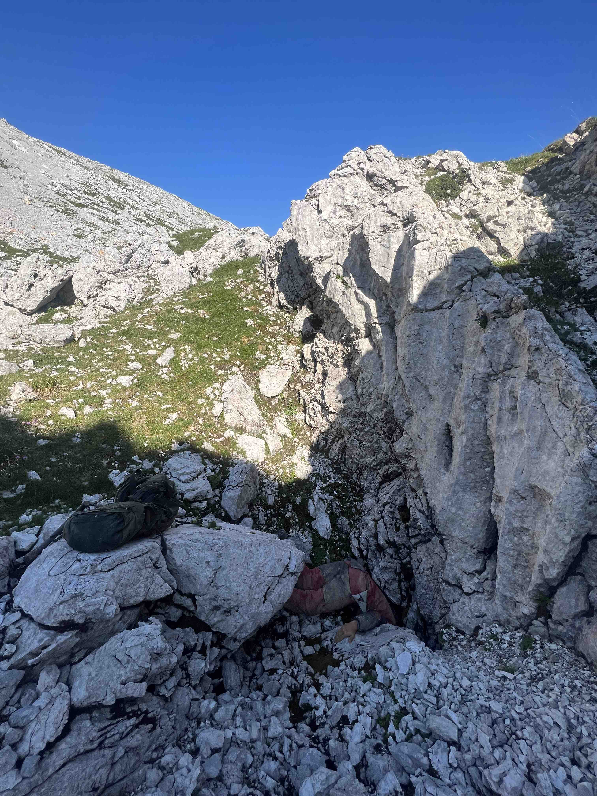

- First logged in 2022
  - A fairly small, draughting, rubble-filled hole about a meter cubed
  - Likely to have been snow covered previously given how sheltered and cold it is
  - Considering draught was felt on a very warm still day, this is a promising indication of nearby cave passage
  - No continuation or digging potential, not promising as a lead in itself

### K29

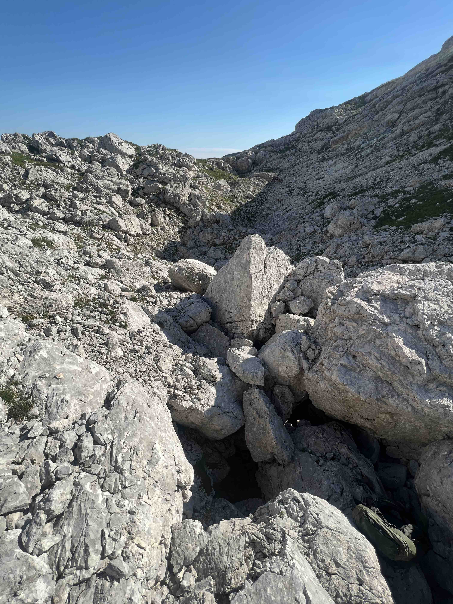

- Previously logged as K99 on the old GPS files, but no mention of it in any hollow mountain editions so unclear why it broke with the area K naming convention
- Logged as K29 in 2022
  - A small chamber 5m underneath large boulders
  - Leads to a second small alcove
  - Not promising as a lead in itself, but cold
  - No obvious draught on a very warm and still day

### LP1

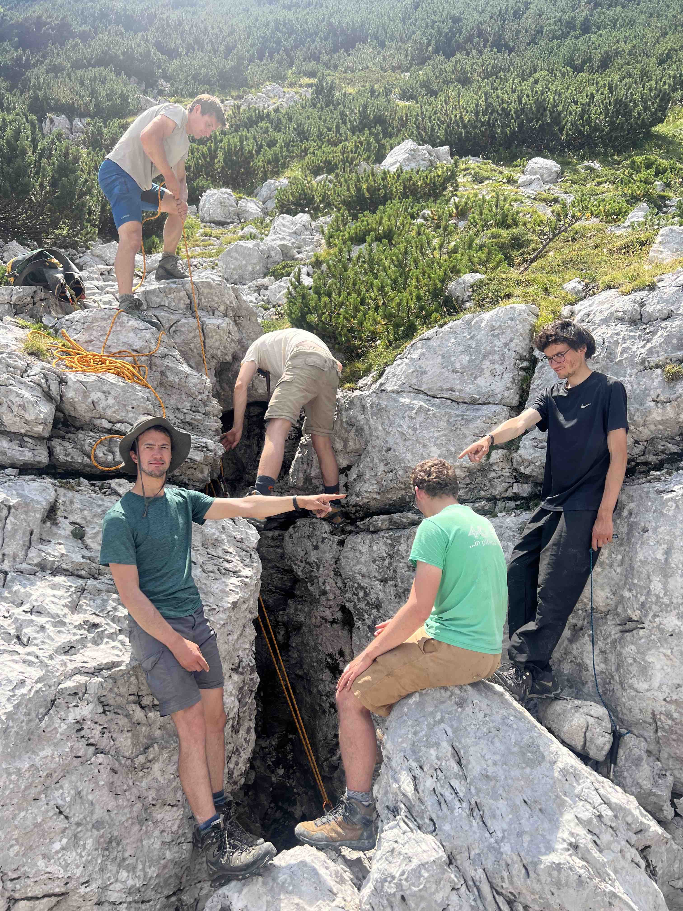

- Discovered in 2022
  - LP = Limestone Pavement, as previously caves here were named TR1,2,3 etc. but this system breaks down when anyone other than Tanguy finds a cave
  - Small chamber filled with rocks which can be reached from multiple entrances
  - Additional entrance has obvious cave below, likely providing a better entrance but blocked by large rocks
  - Initial hauling and digging of this better entrance
  - Inside loose slope leads to snow plug with crawl going around corner beyond, not pushed as no oversuit available
  - No breakthrough made - good potential, worth revisiting

### LP2

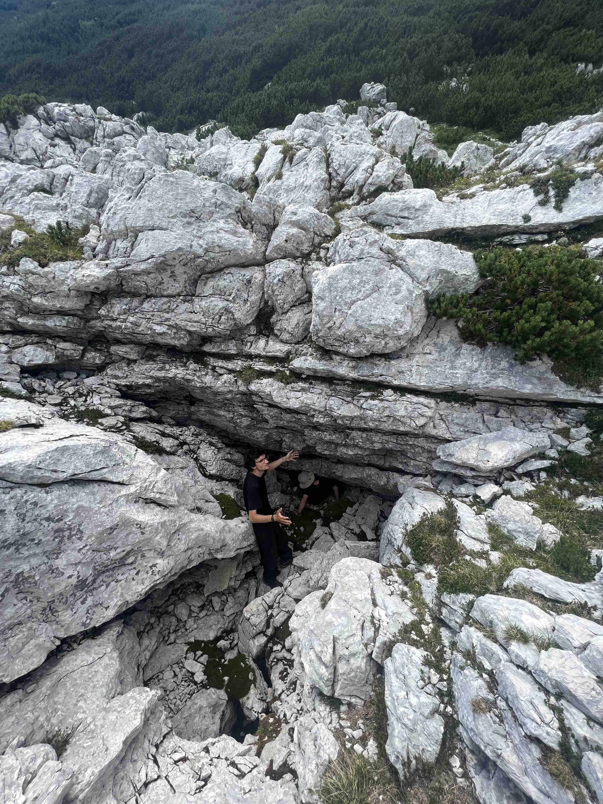

- Discovered in 2022
  - 2m descent to snow plug
  - Draught disappears in front and to the left in a small rift not possible to dig
  - Snow tasted of high quality, according to Leo

### LP3

- Discovered in 2022
  - Not descended, no notes taken at the time
  - May be worth revisiting

### LP4

- Discovered 2022
  - May have been descended before
  - Likely plugged by snow
  - Unclear from notes whether this is worth returning to

### LP5

- Discovered 2022
  - Big hole with gravel and snow at the bottom
  - Likely connects with LP4
  - Unclear from notes whether this is worth returning to

### LP6

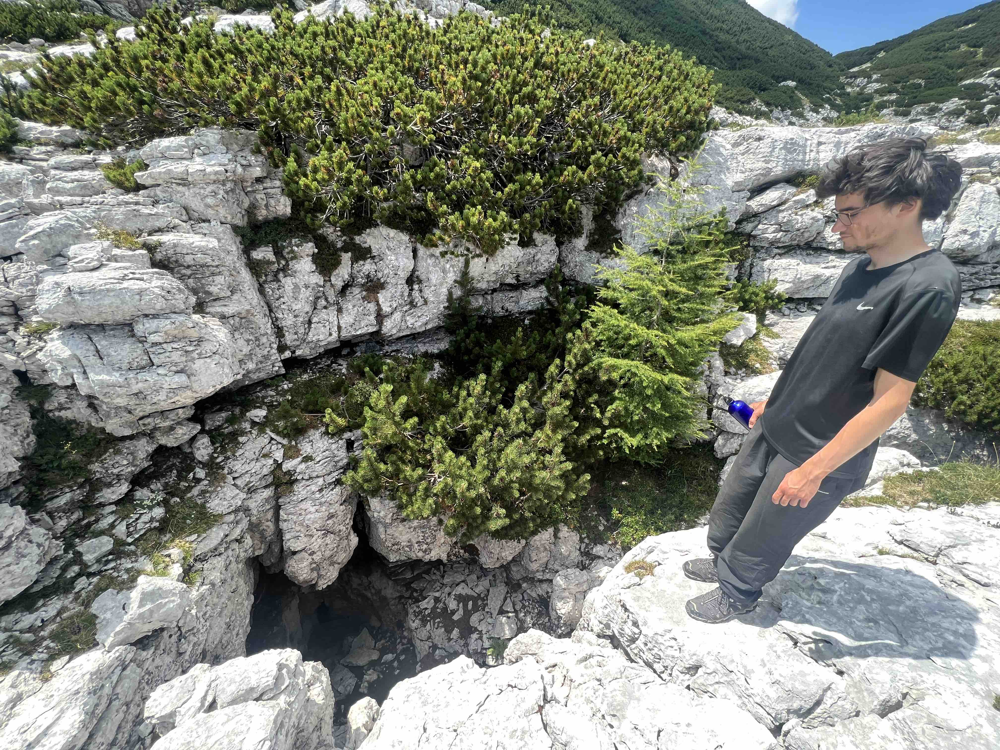

- Discovered in 2022
  - Hole in side of shake hole blocked by boulder with visible slope underneath
  - Looks possible to widen the entrance
  - Worth revisiting

### LP7, Gardeners of the Galaxy, The Jaws of Death

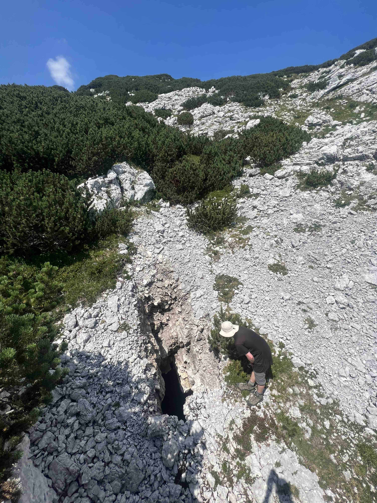

- Discovered in 2022
  - A new hole had opened up in a shake hole since the previous expedition before covid
  - Far too loose to descend this year, so instead we chucked a load of rocks down it (many good videos)
  - These are the jaws of death that nearly ate Rory Rose

### LP8

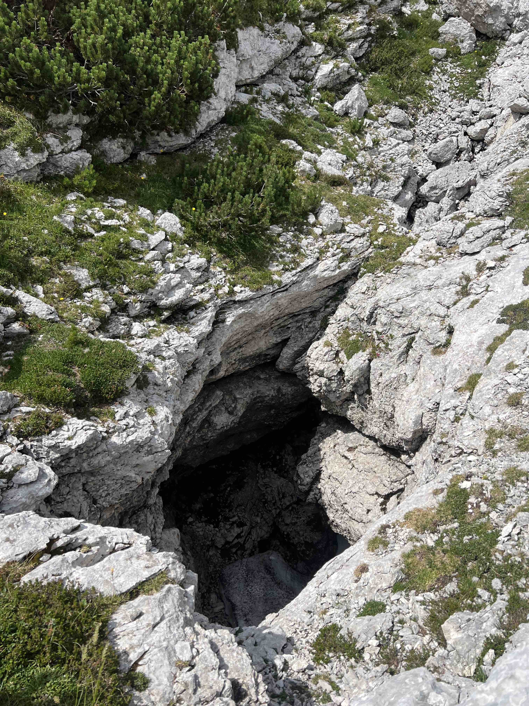

- Discovered in 2022
  - Not descended but look interesting given entrance is recently exposed above snow plug
  - Worth revisiting, since new entrances may have been revealed

### LP9

- Discovered in 2022
  - Only discovered this cave after leaving the mountain
  - Had initially thought this was PF10 but apparently not, since actual entrance was instead logged as M24, and this entrance as PF10
  - The "M24" entrance, which is larger and much further down the pavement has been confirmed as PF10
  - This means this is not a logged cave, but does look like it might have already have been descended
  - Rocks fall a fair way, definitely worth a look
  - Not logged on the GPS since I thought it was PF10, it's high up in the valley, higher up than all other logged caves, and is hidden in a small shake hole
  - Next to and just above Alex Seaton's old dig into the side of a cliff

### M1

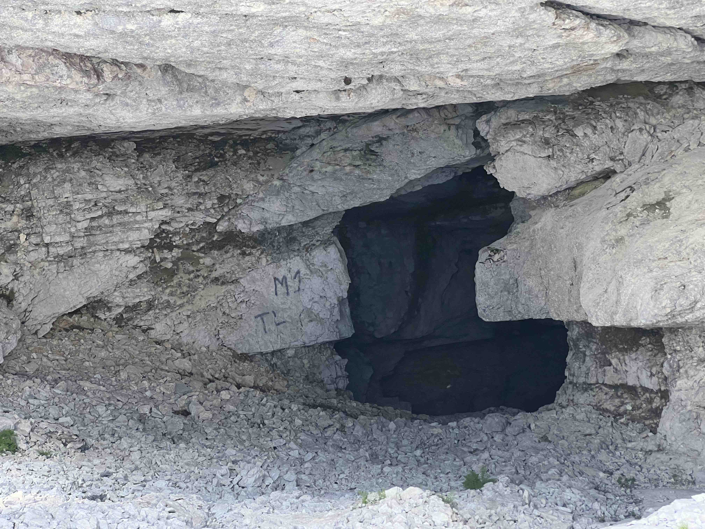

- Depth in 1983 recorded as -61m [HM1, page 13]
- Revisited in 2007 [HM2 draft, page 13]
  - Repushed and resurveyed
  - One ongoing lead left in a window, which may require some chemical persuasion

### M2

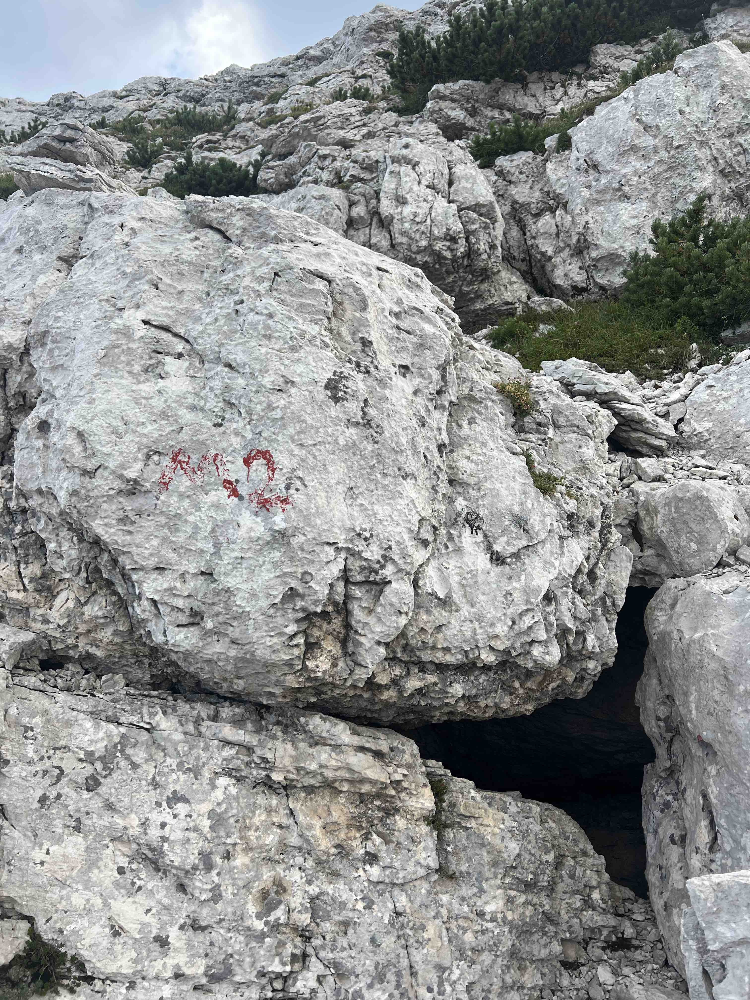

- An entrance to the system. Discovered by the Slovenes back in the 70s [HM1, page 6]

### M3

- No known coordinates, altitude or depth as of 1993 [HM1, page 13]
- Spotted some coordinates on the [old Slovenia expo website](https://www.union.ic.ac.uk/rcc/caving/old/slovenia/report/cavedata)

### M4

- No known depth as of 1993 [HM1, page 13]
- Relogged in 2022
  - Not descended
  - M4 painted in blue, rather than red paint for some reason
  - May be worth revisiting, since close to the bivi

### M5

- No known coordinates, altitude or depth as of 1993 [HM1, page 13]
- Spotted some coordinates on the [old Slovenia expo website](https://www.union.ic.ac.uk/rcc/caving/old/slovenia/report/cavedata)

### M6

- Depth indicated as -67 m as of 1993 [HM1, page 13]
- Spotted some coordinates on the [old Slovenia expo website](https://www.union.ic.ac.uk/rcc/caving/old/slovenia/report/cavedata)

### M7

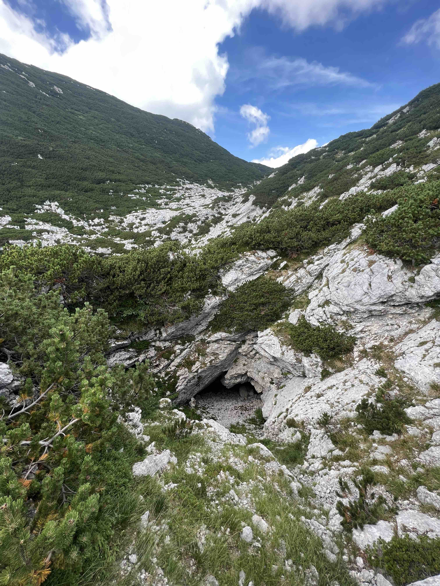

- Depth indicated as -20m as of 1993 [HM1, page 13]
- Relogged in 2022

### M8

- Depth indicated as -13m as of 1993 [HM1, page 13]
- Relogged in 2022

### M9

- Depth indicated as -19m as of 1993 [HM1, page 13]
- Relogged in 2022

### M10

- Depth indicated as -33m as of 1993 [HM1, page 13]
- Visited frequently to collect snow for water
- Explored more thoroughly in 2015 [HM3, page 111]
  - One way on dies in a too-tight rift
  - Another route dies in an icy section

### M11

- Depth indicated as -6m as of 1993.
- "It is difficult to understand why holes such as M11 (6m deep!) were noted, as the plateau has many similar or deeper surface holes which were not then formally recognised." [HM1, page 13]
- Spotted some coordinates on the [old Slovenia expo website](https://www.union.ic.ac.uk/rcc/caving/old/slovenia/report/cavedata)

### M12

- Depth indicated as -15m as of 1993 [HM1, page 13]
- Possibly relocated 2022
  - Not descended but found a cave which looks dug out, and is in the vicinity of M12 on the GPS
  - At the exact location of M12 on the GPS, there are no obvious entrances
  - M12 could be off the cliff, since some old coordinates are dozens of meters away from their actual location
  - Should definitely be investigated, can hear a small chamber when rocks thrown

### M13

- Depth indicated as -15m as of 1993 [HM1, page 13]
- Spotted some coordinates on the [old Slovenia expo website](https://www.union.ic.ac.uk/rcc/caving/old/slovenia/report/cavedata)

### M14

- Depth indicated as -22m as of 1993 [HM1, page 13]
- Spotted some coordinates on the [old Slovenia expo website](https://www.union.ic.ac.uk/rcc/caving/old/slovenia/report/cavedata)

### M15

- Depth indicated as -58m as of 1993 [HM1, page 13]
- Relogged 2022

### M16

- An entrance to the main system discovered by the Slovenes in 1982. [HM1, page 8]

### M17

- Depth indicated as -58m as of 1993 [HM1, page 13]
- Further explored in 1994, HM1 page 25 with survey
  - Pushed until it got too cold, going lead at bottom of cave
- Spotted some coordinates on the [old Slovenia expo website](https://www.union.ic.ac.uk/rcc/caving/old/slovenia/report/cavedata)

### M18, Torn T-Shirt Pot, Jama Strgane Srajce

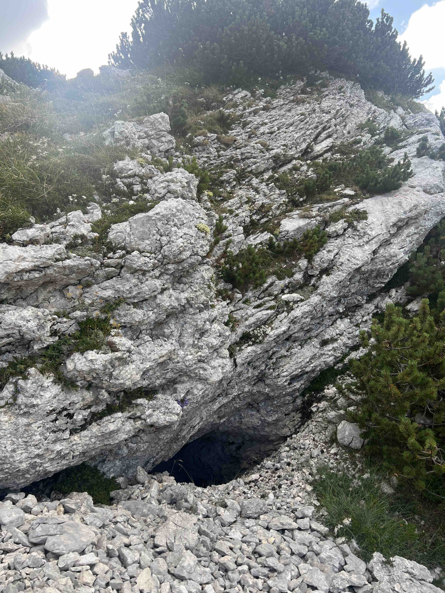

- Large entry about discovery in HM1 page 19 from 1994
- An entrance into the main system

### M19, BS Pot

- Entry about discovery in HM1 page 25 from 1994
  - Extremely tight and loose
  - Next to M17
  - Incredibly strong draft
  - Pushing stopped due to incredibly loose walls requiring shoring
- Spotted some coordinates on the [old Slovenia expo website](https://www.union.ic.ac.uk/rcc/caving/old/slovenia/report/cavedata)

### M20, White Shiver Pot

- Large entry about discovery and survey in HM1, page 17, 1994
  - Large 15m pothole with 20m drop to a snow plug
  - Squeezing past the snow plug led to a large chamber
  - No indication of continuation of digging potential
- Spotted some coordinates on the [old Slovenia expo website](https://www.union.ic.ac.uk/rcc/caving/old/slovenia/report/cavedata)

### M21, B9, Jackie's Blower

- Entry about discovery and survey in HM1, page 33, 1995
  - Two entrances near the top of the cliff
  - Very loose
- Revisited in 2016 [HM3, page 219]
  - Has apparently been visited a number of times since initial discovery
  - The bottom pitch was pushed but no mention of whether this lead is ongoing or not

### M22, Venus Cave

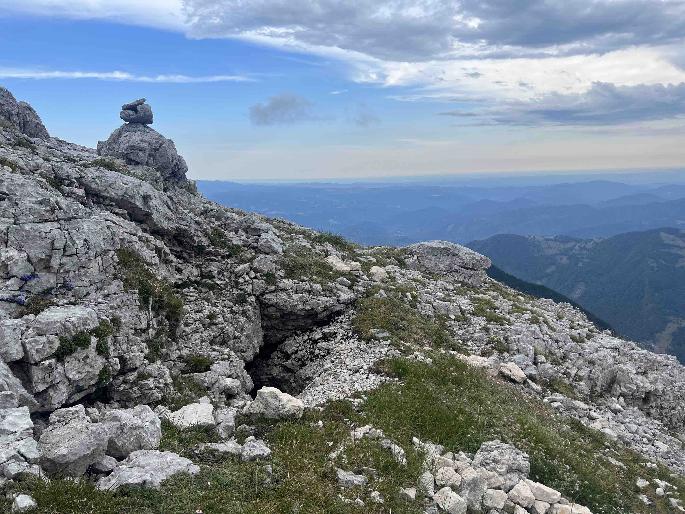

- Entrance about discovery and survey in HM1, page 34, 1995
  - Named as it sucked flies in like a venus fly trap, strong draft!
- Explored in 2018 as seen in 2018 documentary video, no encouraging ways on after digging

### M23, Julie's Pantry Cave

- Entry on discovery and survey in HM1, page 32 from 1995
  - Very strong draft
  - Terminates at a small passage
- Spotted some coordinates on the [old Slovenia expo website](https://www.union.ic.ac.uk/rcc/caving/old/slovenia/report/cavedata)

### M24, PF10

- Entry about discovery and survey in HM1, page 36, 1995
  - Deemed too unstable to continue exploration
  - Abandoned for other leads in 1995
- Relocated in 2022
  - Previously M24 and PF10 were logged as being over 100m apart
  - Upon throwing rocks down, sounds of ice smashing could be heard

### M25, Gulliver's Kipper Cave

- Entry about discovery in HM1, page 33, 1995
  - On the face of Mig, visible from the shepherd's huts
  - Initially opens up but all proceeding chambers closed down
  - Little effort put into the cave, no survey taken
- May have digging potential

### MLC, My Little Cave, Janet's Little Cave

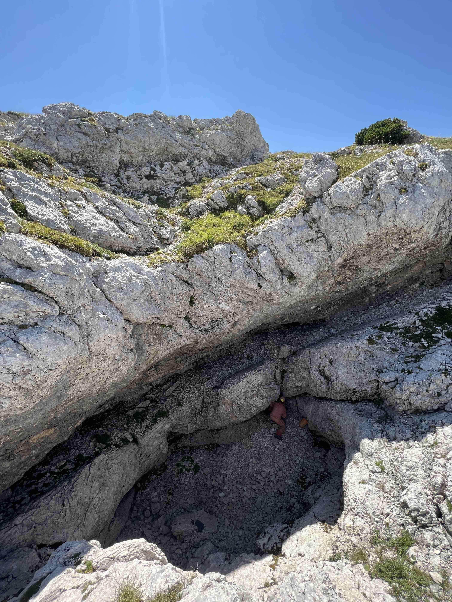

- Unclear when this was first discovered
- Surveyed extensively by Tanguy in 2019
- Revisited in 2022
  - Re-explored in it's entirety, not realising it had been surveyed in 2019, but no new leads found
  - Dug further but slow progress and pronounced dead

### Monatip

- An entrance to the main system discovered in 2007 [HM2 draft, page 18]

### Moth Cave

- Discovered in 2006 [HM1, page 207]
  - Located close to Hare cave
  - Left at a pile of draughting boulders which are easy and quick to dig
  - About an hour of digging was carried out in 2006
- Revisited in 2007 [HM2 draft, page 15, page 25]
  - Large volumes of gravel removed
  - All leads seem to have been killed
  - Only way on is another squeeze which would require rock removal to pass

### N01

- Not the same as the N1 in area N
- Rediscovered in 2014 [HM3, page 104]
  - Found to be 3m deep and leading into a small chamber but no sign of downward progression

### N1

- No known information
- Note that this is different to the N01 found to the south of Kuk

### N2

- No known information

### N3

- No known information

### N4

- No known information

### N5

- No known information

### N6

- No known information

### N7

- No known information

### N7

- No known information

### N8

- No known information

### N9, Kuk Pot

- First mentioned in 2012 [HM2 draft, page 136]
  - First two pitches dropped
  - Continuation visible but left due to lack of time
- Returned to and killed in 2019 (not written up yet)

### P1

- Included on the area N map, HM3 page 264
- No information regarding this cave was found

### Planika

- Discovered in 2007 [HM2 draft, page 18]
  - Large snow and ice filled cave with holes driven through it by water and air
  - Ends in an un-pushed ice tube after a scary boulder funnel
- Revisited in 2008 [HM2 draft, page 31]
  - No further progress on the route from the previous year made due to high snow levels
  - A new rift found from a water drilled hole through the snow plug
  - Another chamber was found from a window

### Postcard Cave

- Briefly mentioned in HM1, page 183, 2004
  - In an adjacent shakehole to the east of Hare Cave
  - No further information

### Primadona

- A main entrance to the main system known about for a long time by the Slovenes
- First mentioned in HM1, page 118, 2000

### Pueblo

- Not a cave
  - Fratnik's old bivi spot from many decades ago
  - Still filled with metal tent poles
- Relogged in 2022

### Razor Cave

- A cave near the Razor hut, extensively explored by the JSPDT [HM1, page 208, 2006]
- Surveyed in 2007 [HM2 draft, page 14]

### Royston Vasey

- Entry about discovery and a survey in HM1, page 147, 2001
  - Very close to the bivi, in an 8m deep shake hole
  - Good digging potential given it's proximity to the bivi
- Rediscovered in 2008 [HM2 draft, page 44]
  - Not pushed any further, only rediscovered
- Re-bolted and dug in 2022
  - All possible leads investigated
  - Can hear cave continues onto another chamber at bottom of final pitch but not worth blasting since walls close in
  - Conclusively dead this time

### S2

- No known information

### S3

- No known information

### S4

- No known information

### S5

- Discovered in 2013 [HM3, page 37]
  - Initially a free-climbable p6, followed by a p20 that requires a rope
  - Appears that this hasn't been descended

### S6

- Discovered in 2013 [HM3, page 37]
  - Strongly drafting, just as much as S1
  - Requires work but is the most promising lead in the area

### S7

- Discovered in 2013 [HM3, page 37]
  - Cold air drafting from between two boulders
  - Not an actual entrance, but could be dug into one

### S12

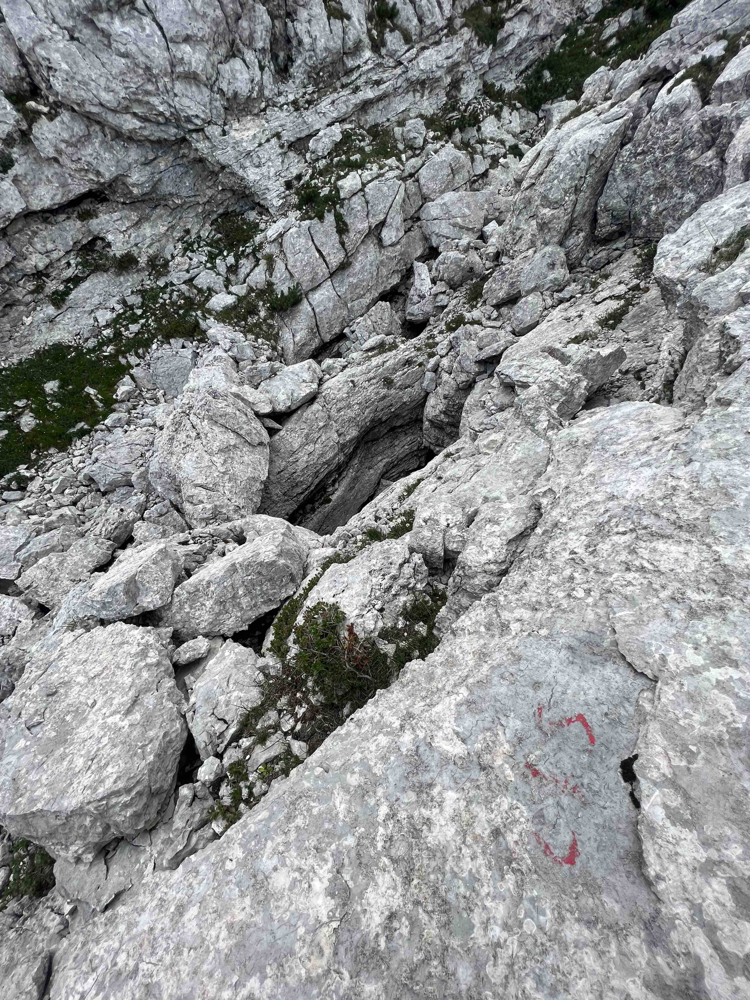

- Relogged in 2022
  - No known information
  - If this is S12, where are S8-11?

### S-A

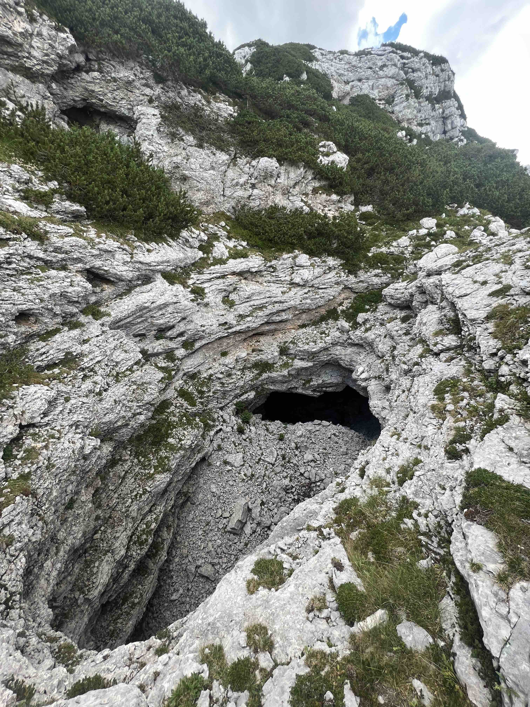

- Relogged in 2022
  - No idea what this is, but there's a large shake hole there
  - Likely a nearby cave, but no obvious what the GPS point was referring to
  - Should ask some old(er) lags

### Samo1

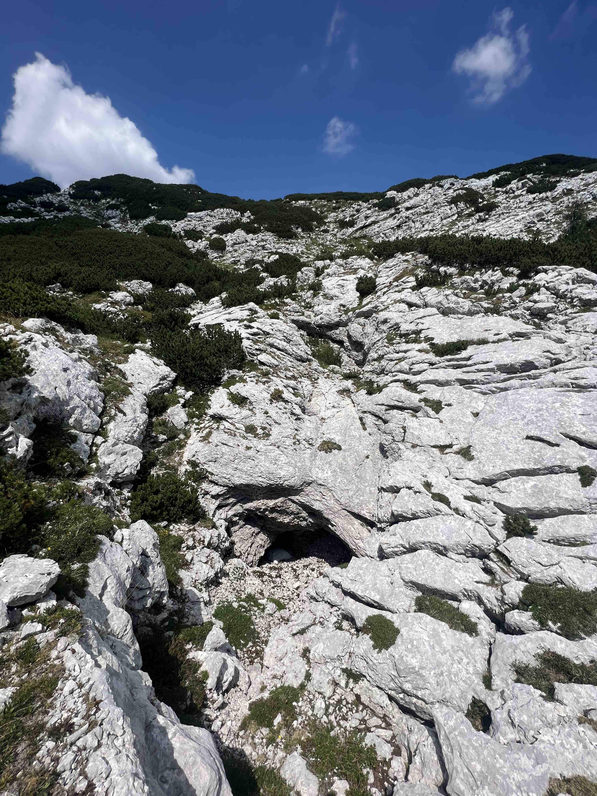

- Unclear when Samo first logged this
- Revisited in 2022
  - Crawl goes down at least 5m to capped entrance to small chamber
  - Large draft and nearby to new Gardeners of the Galaxy hole, and clearly in the same line of shake holes as it, but cave heads in different direction
  - Not worth revisiting

### Samo2

- Unlcear when Samo first logged this
- Revisited in 2022
  - 10m deep shaft, gravel floor with ice plug 2 by 10 m diameter at bottom
  - Big draught and adjacent holes connects back in
  - Cave conclusively killed

### Stag Cave

- Discovered in 2007 [HM2 draft page 15]
  - Within 20m of the tents
  - An initial pitch leads to a dead chamber

### Storm cave

- Description in HM1, page 184, 2004
  - Main way on blocked by snow
  - Other entrances in the area which were blocked by snow

### Sunset Hole

- Discovered in 2014 [HM3, page 104]
  - A small hole, appears to have not been investigated

### T2

- Mentioned in HM1, page 99, 1998
  - A tight strongly drafting rift passage that requires hammering

### The Freezer

- Mentioned in HM1, page 148, 2001
  - Further up the Gardener's World valley
  - One un-pushed lead at the end in a dodgy boulder choke
  - Contained a nice ice stalactite
- Spotted some coordinates on the [old Slovenia expo website](https://www.union.ic.ac.uk/rcc/caving/old/slovenia/report/cavedata)

### The Hairdryer

- Mentioned in HM1, page 99, 1998
  - "A slow shuffle into the bedding leads to a small, 8” hole. Beyond this restriction was black space, and the source of the very strong draft"
  - Doesn't seem to have been investigated further

### TR1

- Discovered in 2014 [HM3, page 62]
  - A 1 x 1.5 m hole plugged with snow
  - Multiple entrances, some of which free climbable and reaches floor of ice and rubble
  - Left undescended
- Returned to in 2016 [HM3, page 188]
  - All leads were found to die quickly in rubble and ice

### TR2

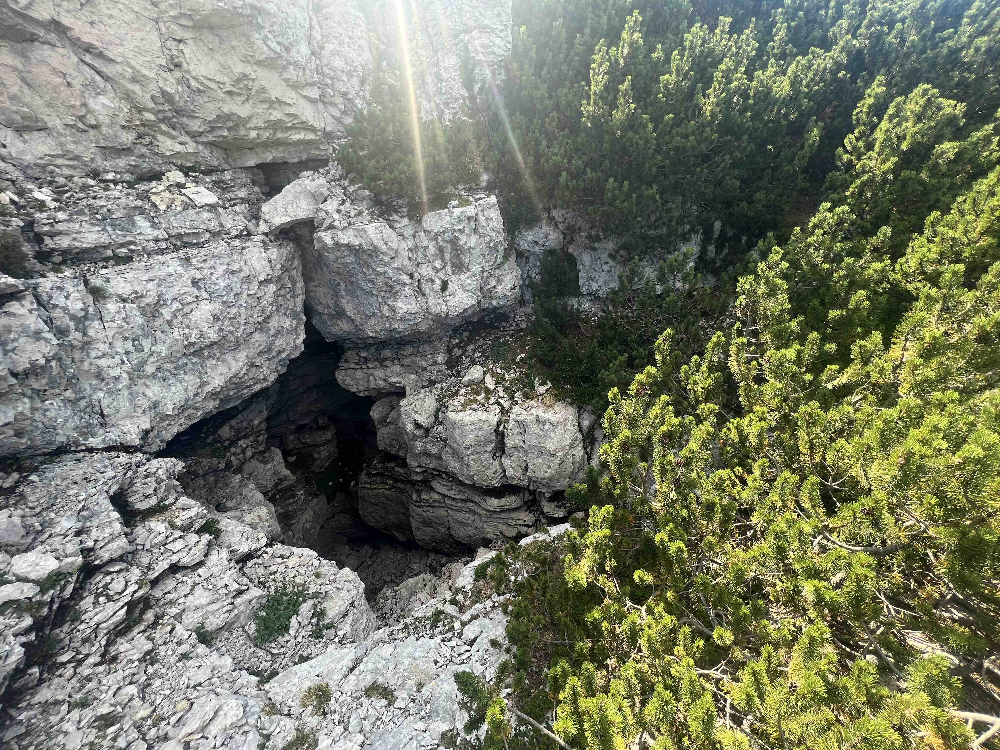

- Discovered in 2014 [HM3, page 62]
  - Snow and rubble slope leads down to a low chamber with several blind avens
  - Terminal chamber reached after a short dug out crawl
- Revisited in 2022 by David and Rory
  - Near entrance just prior to crawl, on left space noticed under boulder, dug out, leading to chamber
  - Chamber terminates in too tight rift, Aven above chamber leads to undug light from surface
  - Draft disappears underneath climb down into chamber into rock floor
  - Thin person should investigate rift, might be possible to blast

### TR3

- Discovered in 2014 [HM3, page 62]
  - Entrance choke can be down-climbed to a small chamber with continuation requiring rock removal with tape, crowbar and chisel

### TR4

- Discovered in 2014 [HM3, page 63]
  - Obvious dig with upturned boulders near entrance

### TR5

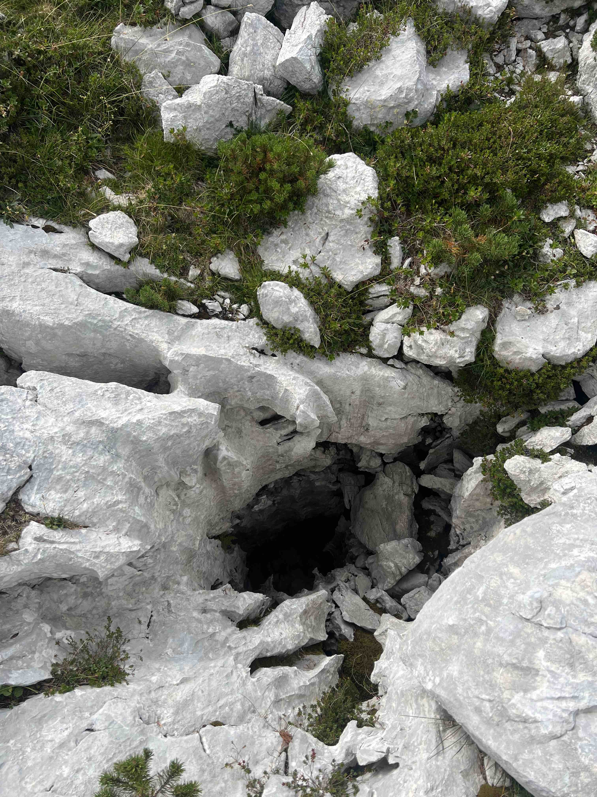

- Discovered in 2014 [HM3, page 63]
  - Small free climb down
  - Draughting with easy digging

### TR6

- Discovered in 2014 [HM3, page 63]
  - Dig in vegetated shakehole
  - Closes down as boulders meet ceiling
  - Harder digging

### TR7

- Discovered in 2014 [HM3, page 63]
  - No obvious digging, both branches quickly become impassable

### TR8

- Discovered in 2014 [HM3, page 63]
  - Ends in rift blocked by ice and cobbles
  - Would need serious digging if ice still present

### TR9

- Discovered in 2014 [HM3, page 63]
  - Obvious way on is choked, no indication of how easy digging / rock removal might be

### U-Bend 571

- Another entrance to the main system that quickly connects with Primadona
- First mentioned in HM1, page 120, 2000
- Connected to Primadona in 2007 [HM2 draft, page 14]

### Vilinksa Jama

- Discovered in 2008 [HM2 draft, page 43]
  - Connects to Vrtnarija

### Vrtnarija, Gardener's World

- Entrance into the main system that began as a dig by Ben Ogborne [HM1, page 99, 1998]
- The entrance dig broke into the passage in 2000 [HM1, page 128]
